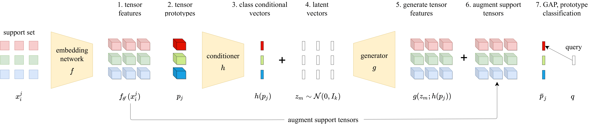
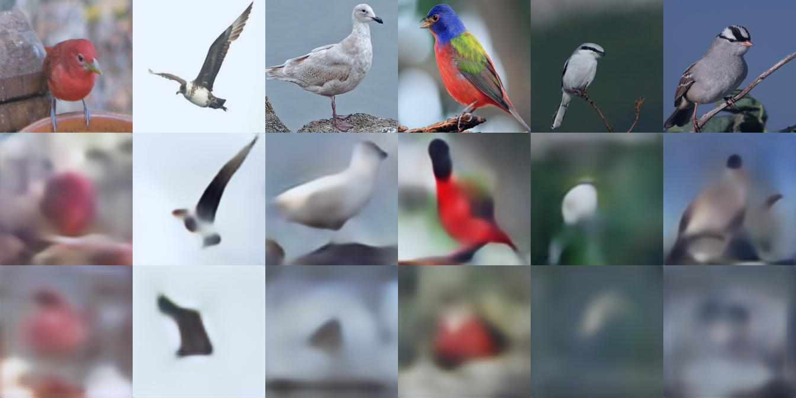

# TFH

This repo covers the implementation of the following paper: 

**"Tensor feature hallucination for few-shot learning (WACV 2022)"** [Pre-print](https://arxiv.org/abs/2106.05321),
<p align='center'>
  
</p>

<p align='center'>
  
</p>

**Picture:** *CUB original images (row 1) followed by images generated from separately trained reconstructors using as input tensor features (row 2) or vector features (row 3). More results and implementation details are given in the supplementary material.*

## Abstract
Few-shot learning addresses the challenge of learning how to address novel tasks given not just limited supervision but limited data as well.  An attractive solution is synthetic data generation. However, most such methods are overly sophisticated, focusing on high-quality, realistic data in the input space. It is unclear whether adapting them to the few-shot regime and using them for the downstream task of classification is the right approach. Previous works on synthetic data generation for few-shot classification focus on exploiting complex models, e.g. a Wasserstein GAN with multiple regularizers or a network that transfers latent diversities from known to novel classes. We follow a different approach and investigate how a simple and straightforward synthetic data generation method can be used effectively. We make two contributions, namely we show that: (1) using a simple loss function is more than enough for training a feature generator in the few-shot setting; and (2) learning to generate tensor features instead of vector features is superior. Extensive experiments on miniImagenet, CUB and CIFAR-FS datasets show that our method sets a new state of the art, outperforming more sophisticated few-shot data augmentation methods.

If you find this repo useful for your research, please consider citing the paper
```
@conference{tfh,
   title = {Tensor feature hallucination for few-shot learning},
   author = {M. Lazaroux and T. Stathaki and Y. Avrithis},
   booktitle = {Proceedings of IEEE/CVF Winter Conference on Applications of Computer Vision (WACV)},
   address = {Waikoloa, HI, US},
   year = {2022}
}
```
## Datasets
For all of our experiments regarding ResNet-18 backbone, we used the datasets provided by [S2M2_fewshot](https://github.com/nupurkmr9/S2M2_fewshot).

For ResNet-12 experiments we used the datasets as provided by [DeepEMD](https://github.com/icoz69/DeepEMD). For miniImagenet we used the provided pre-trained network and for CUB we train the backbone network ourselves using the code from [DeepEMD](https://github.com/icoz69/DeepEMD).

## Training ResNet-18
**Note** Two stage training regime. For the first stage train the model using `train_res18.py` which uses standard multi-class cross entropy loss.
For the second stage use `res18_distil.py` which uses standard cross entropy loss + knowledge distillation using the model trained in stage 1 as the teacher model.

## Training tensor feature hallucinator

## Testing with baselines


## Contacts
For any questions, please contact:

Michalis Lazarou (ml6414@ic.ac.uk)  
Tania Stathaki (t.stathaki@imperial.ac.uk)  
Yannis Avrithis (yannis@avrithis.net)

## Acknowlegements
[rfs](https://github.com/WangYueFt/rfs)

[IDeMe-Net](https://github.com/tankche1/IDeMe-Net)

[Dual TriNet](https://github.com/tankche1/Semantic-Feature-Augmentation-in-Few-shot-Learning)

[S2M2_fewshot](https://github.com/nupurkmr9/S2M2_fewshot)

[DeepEMD](https://github.com/icoz69/DeepEMD)


